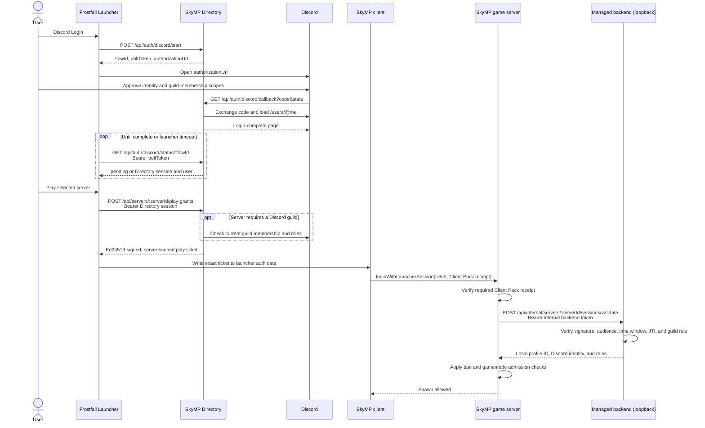

# Authentication Flow

SkyMP's directory-managed authentication separates a user's Discord login from
admission to an individual game server. The launcher signs in to one selected
SkyMP Directory, asks that Directory for a short-lived ticket for the selected
server, and passes the ticket unchanged to the game client. The game server
redeems it through its loopback-only managed backend.

The server operator does not run an OAuth callback and never receives the
user's Discord access or refresh token.

## Components and trust boundaries

| Component | Responsibility |
| --- | --- |
| Discord | Authenticates the Discord account and supplies the identity and OAuth tokens to the Directory callback. |
| SkyMP Directory | Owns the Discord OAuth application, stores the Discord identity, optionally checks guild membership, and signs server-scoped play grants. |
| Frostfall / SkyMP Launcher | Pins one Directory signing key, holds that Directory's login session, obtains a new play ticket when the user selects **Play**, and supplies it to SkyMP. |
| SkyMP client | Reads the launcher-created auth data and sends the play ticket in `loginWithLauncherSession`. It does not perform Discord OAuth. |
| SkyMP game server | Forwards the ticket to its managed backend and admits the returned server-local profile after compatibility and gamemode checks. |
| Managed backend | Verifies Directory signatures and access rules, prevents first-redemption replay, maps the Discord identity to a server-local profile, and maintains the reconnect session. Its authentication API is restricted to loopback. |

The launcher and managed backend both pin the selected Directory's Ed25519
public key. A custom Directory must use HTTPS, except for loopback development,
and the launcher requires the user to confirm the discovered key fingerprint.
Changing Directories clears the old Directory session, per-server tickets,
cached Discord user, private join codes, and other Directory-specific state.

## End-to-end flow



### 1. Discord login

`POST /api/auth/discord/start` creates a ten-minute OAuth flow. It returns:

- an opaque flow ID;
- a secret poll token, used only by the launcher in the `Authorization` header;
- a Discord authorization URL containing a separate OAuth `state` value.

The launcher opens the URL in the system browser and polls
`GET /api/auth/discord/status/:flowId`. Discord redirects the browser to
`GET /api/auth/discord/callback` on the Directory. The Directory consumes the
one-time state, exchanges the authorization code, and loads the Discord user.
It requests the `identify` and `guilds.members.read` scopes.

Once the callback completes, polling returns a Directory session and the public
Discord identity. The Directory session is valid for 30 days unless it is
revoked. Frostfall currently polls once per second for up to 120 seconds; that
launcher timeout is shorter than the server-side OAuth-flow lifetime.

### 2. Per-server authorization

The Directory session is not sent to a game server. When the user selects
**Play**, the launcher sends it as a bearer token to:

```text
POST /api/servers/:serverId/play-grants
```

If the server descriptor requires membership in a Discord guild, the Directory
checks the current user through Discord. Access and refresh tokens remain
inside the Directory. Membership results, including role IDs for members, are
cached for 60 seconds. An expired Discord access token is refreshed before the
membership request when a refresh token is available.

The resulting play grant contains a random JTI, the target server ID as its
audience, issue and expiry times, the Discord identity, and any verified guild
roles. The Directory signs the canonical grant with Ed25519 and returns the
signed envelope as one opaque base64url ticket.

### 3. Launcher and client handoff

Frostfall stores Directory sessions and per-server play tickets with Electron's
OS-backed `safeStorage`. Before launch it writes the selected server's exact
ticket into SkyMP's `auth-data-no-load` launcher-auth file and marks the runtime
as `directory-managed`. The client requires both that launch mode and a
non-empty session. It sends the ticket unchanged in the
`loginWithLauncherSession` packet after the network connection is accepted.

The launcher-auth file is a handoff to the local game process, not a second
token exchange. Frostfall creates it with owner-only mode where the filesystem
supports that mode and removes it during logout. Local users with equivalent
account privileges can still inspect the running process and its files, so the
play ticket must continue to be treated as a credential.

### 4. First redemption and reconnect

The game server sends the ticket to its backend through:

```text
POST /api/internal/servers/:serverId/sessions/validate
Authorization: Bearer <internal backend token>
Content-Type: application/json

{ "ticket": "<opaque play ticket>" }
```

This endpoint is bound to loopback and is not a launcher or public-internet
API. The backend requires its separate internal bearer token even on loopback.

On first redemption, the backend verifies:

- the pinned Directory Ed25519 signature;
- the registered server ID in the ticket audience;
- the issue time and maximum 60-second validity window;
- the one-time JTI, preventing a second session from being created from the
  same grant;
- the shape of any membership claim and the server's configured guild rule.

It then maps the stable Discord ID to a numeric profile local to this server and
stores a hash of the opaque ticket. A successful first redemption returns HTTP
`201`.

The same ticket becomes the reconnect credential after redemption. A later
lookup checks the stored hash before attempting to validate the now-expired
one-minute grant again. Reconnects therefore remain valid until the backend
session expires. `sessions.ttlSeconds` controls that lifetime and defaults to
43,200 seconds (12 hours) in the generated configuration. A successful
reconnect returns HTTP `200`.

## Credentials and stored data

| Item | Held by | Lifetime | At-rest handling |
| --- | --- | --- | --- |
| OAuth state and poll token | Browser/launcher and Directory | 10-minute OAuth flow; single callback completion | The Directory stores hashes. The launcher keeps the poll token for the active login attempt. |
| Discord access and refresh tokens | Directory only | Determined by Discord; access is refreshed when required | Encrypted by the Directory with AES-256-GCM using `DIRECTORY_TOKEN_ENCRYPTION_KEY`. |
| Directory session | Launcher and Directory | 30 days or until logout/revocation | OS-encrypted by Frostfall; stored as a hash by the Directory. |
| Play ticket | Launcher, client, and managed backend | 60 seconds for first redemption; then the backend reconnect lifetime | OS-encrypted in Frostfall's per-server settings, copied to the launcher-auth handoff file, and stored as a SHA-256 hash by the backend. |
| Internal backend token | Managed supervisor, game server, and backend | Configured value, or one generated for the current managed-server run | Passed through the child-process environment. Generated values are not written to configuration or logs. |
| Directory signing key | Launcher and managed backend | Persistent trust anchor until explicitly changed | Public key only; pinned by fingerprint/registration and used to verify signed data. |

The Directory stores the Discord ID, username, and avatar associated with a
launcher session. The managed backend stores the server-local profile mapping,
username, Discord ID, verified roles, session expiry, and only the hash of the
play ticket.

A server operator or gamemode can receive the numeric local profile ID,
Discord ID, username, and roles that are returned by the backend. It never
receives the Discord access token, refresh token, Directory session, OAuth poll
token, or Directory encryption key.

## Logout and expiration

Frostfall logout asks the active Directory to revoke the Directory session,
then clears the local Directory session, all per-server tickets and profile
IDs, the cached Discord user, and the launcher-auth file. Local state is still
cleared if the remote revocation request fails.

At startup, Frostfall validates a saved Directory session with
`GET /api/auth/session`. An invalid or expired session is cleared and the user
must sign in again. Switching to another Directory also clears authentication
state from Frostfall's settings. The next managed launch requires and writes a
ticket issued by the newly selected Directory.

Already redeemed reconnect sessions live in an individual managed backend.
Logging out of the launcher does not call every game server to revoke those
server-local sessions; removing the tickets from the launcher prevents normal
reuse from that installation.

## Offline mode

Offline mode is a separate local development path. The launcher/client sends a
numeric `profileId` rather than a Directory ticket, and the game server admits
that profile without Directory or Discord validation. It must not be presented
as authenticated directory-managed play.

## Troubleshooting

| Symptom or error | Meaning | Action |
| --- | --- | --- |
| Discord login times out | Frostfall did not observe completion during its polling window, or the ten-minute flow expired. Errors include `oauthFlowExpired` and `invalidPollToken`. | Start Discord Login again and complete the browser consent promptly. Do not reuse an old callback tab. |
| `directorySessionInvalid` or `discordLoginRequired` | The 30-day session was revoked/expired, the Directory identity is missing, or Discord authorization can no longer refresh. | Log out locally if needed, then sign in to Discord again. |
| `guildMembershipRequired` | The selected server requires a Discord guild and the Directory could not confirm membership. | Use the invite URL supplied by the Directory, join the guild, then try **Play** again. Membership results may be cached for up to 60 seconds. |
| `discordRateLimited` or `discordMembershipUnavailable` | Discord could not service the optional membership check. | Retry later; operators should verify Discord availability and Directory OAuth configuration. |
| `invalidPlayGrantSignature` | The ticket was not signed by the Directory key pinned by the managed backend. | Operators should compare the backend's Directory key pin and configured Directory. Do not bypass the check. |
| `playGrantAudienceMismatch` | A ticket issued for another server was presented. | Obtain a new ticket by selecting **Play** for the intended server. |
| `playGrantExpired` | The ticket was not first redeemed within its one-minute window, is not yet valid, or the clocks disagree beyond the configured skew. | Select **Play** again. Operators should also verify Directory and server clocks. |
| `playTicketReplayed` | The JTI was already consumed but no matching reconnect session exists. | Obtain a new play ticket. Operators should investigate unexpected duplicate redemption. |
| Client says it must be started through a current launcher | The `directory-managed` runtime settings or launcher-auth data are absent or malformed. | Start the game with Frostfall instead of launching SKSE or SkyMP directly. |
| `loginFailedClientPackRepairRequired` | Authentication data may be valid, but the client does not match the server's required Client Pack. | Repair the selected server in Frostfall and launch again. |
| `loginFailedBanned` | Identity validation succeeded, but the gamemode rejected the server-local profile. | Contact the server operator; repeating Discord login will not bypass a ban. |

## Contract boundary

There is no public managed-backend OAuth callback, pairing endpoint, HMAC
credential, or launcher-to-backend grant exchange. Launchers communicate with
the Directory. Managed servers register and heartbeat outbound to the
Directory. The only authentication call from the game server goes to its own
loopback backend, while the opaque Directory ticket travels through the
existing SkyMP `session` field.
